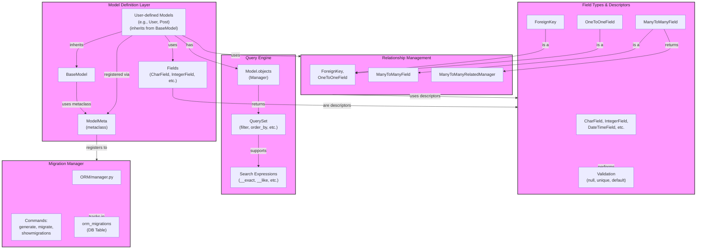

# Custom Python ORM

A simple Object-Relational Mapper (ORM) for Python using SQLite3.

## Features

*   **Model Definition:**
    *   Define models by inheriting from `ORM.base.BaseModel`.
    *   Supports basic field types: `CharField`, `IntegerField`, `DateTimeField` (defined in [`ORM/datatypes.py`](/cs/home/yb33/Documents/NUZP/NUZP_Thesis/ORM/datatypes.py)).
    *   Field options: `null`, `unique`, `default`.
    *   Automatic `id` primary key field.
*   **Relationship Fields:**
    *   `ForeignKey`: Defines a many-to-one relationship. Stored as `field_name_id` in the database. Uses `ON DELETE CASCADE`. ([`ORM/fields.py`](/cs/home/yb33/Documents/NUZP/NUZP_Thesis/ORM/fields.py))
    *   `OneToOneField`: Defines a one-to-one relationship (inherits from `ForeignKey` with `unique=True`). ([`ORM/fields.py`](/cs/home/yb33/Documents/NUZP/NUZP_Thesis/ORM/fields.py))
    *   `ManyToManyField`: Defines a many-to-many relationship using an automatically generated or custom junction table. ([`ORM/fields.py`](/cs/home/yb33/Documents/NUZP/NUZP_Thesis/ORM/fields.py))
*   **Database Operations (CRUD):**
    *   **Create:** `Model.insert_entries([...])` supports inserting lists of model instances or dictionaries. Updates instance IDs upon insertion. ([`ORM/base.py`](/cs/home/yb33/Documents/NUZP/NUZP_Thesis/ORM/base.py))
    *   **Read (Querying):**
        *   Access data via the `Model.objects` manager ([`ORM/base.py`](/cs/home/yb33/Documents/NUZP/NUZP_Thesis/ORM/base.py), [`ORM/query.py`](/cs/home/yb33/Documents/NUZP/NUZP_Thesis/ORM/query.py)).
        *   Chainable methods: `filter()`, `order_by()`, `limit()`, `offset()`.
        *   Retrieve all results: `all()`.
        *   Retrieve a single result: `get()` (raises exceptions if none or multiple found).
        *   Filtering supports lookups: `__exact`, `__like`, `__gt`, `__gte`, `__lt`, `__lte`, `__in`, `__neq`. ([`ORM/query.py`](/cs/home/yb33/Documents/NUZP/NUZP_Thesis/ORM/query.py))
        *   QuerySets are iterable and support slicing/indexing (`[0]`, `[:5]`). ([`ORM/query.py`](/cs/home/yb33/Documents/NUZP/NUZP_Thesis/ORM/query.py))
        *   Results are returned as model instances.
    *   **Update:** `Model.replace_entries(conditions, new_values)` updates records matching conditions. ([`ORM/base.py`](/cs/home/yb33/Documents/NUZP/NUZP_Thesis/ORM/base.py))
    *   **Delete:** `Model.delete_entries(conditions)` deletes records matching conditions. Can delete all records with confirmation. ([`ORM/base.py`](/cs/home/yb33/Documents/NUZP/NUZP_Thesis/ORM/base.py))
*   **Relationship Management:**
    *   Access related objects via standard attribute access (e.g., `instance.foreign_key_field`).
    *   Many-to-many relationships provide a manager (`instance.m2m_field`) with methods: `add()`, `remove()`, `clear()`, `set()`, `all()`, `filter()`, `get()`. ([`ORM/fields.py`](/cs/home/yb33/Documents/NUZP/NUZP_Thesis/ORM/fields.py))
*   **Migrations:**
    *   Basic migration system managed by [`ORM/manager.py`](/cs/home/yb33/Documents/NUZP/NUZP_Thesis/ORM/manager.py).
    *   `python ORM/manager.py generate --app <app_folder>`: Creates initial migration files to generate tables based on models found in the specified app folder.
    *   `python ORM/manager.py migrate`: Applies pending migrations (executes the `create_table` methods defined in migrations).
    *   `python ORM/manager.py showmigrations`: Lists the status of migrations (applied/pending).
    *   Tracks applied migrations in the `orm_migrations` database table.
*   **Utilities:**
    *   `instance.as_dict()`: Serializes a model instance (including related IDs) into a dictionary. ([`ORM/base.py`](/cs/home/yb33/Documents/NUZP/NUZP_Thesis/ORM/base.py))
    *   Uses SQLite3 backend with foreign key constraints enabled (`PRAGMA foreign_keys = ON`).

## Coverage

To get coverage:

1. Setup & activate venv:
```bash
python3 -m venv venv
source venv/bin/activate
```

2. Download coverage packages:
```bash
python -m pip install coverage interrogate
```

3. Run coverage test report
```bash
coverage run -m unittest discover -s tests -p 'test*.py'
coverage report -m            # View summary in terminal
coverage html                 # Generate detailed HTML report (view htmlcov/index.html)
```

4. Run coverage docs report
```bash
interroage -vv ORM/ -I # -I to not include __init__.py file
```


